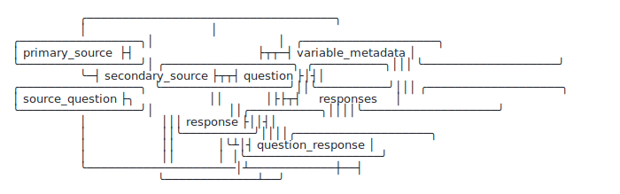

# Connect Data Model

A proposed **relational data model** for the **Connect for Cancer Prevention Cohort Study** (BigQuery) — the foundation for **PR2**, a researcher-facing data warehouse through which Connect will share data with the research community.

It is designed to be **easy to reason about** (a clean star schema over opaque concept IDs), **governed** (per-sensitivity access enforced by BigQuery IAM, in three release tiers), and **lineage-transparent** (every value traceable to source, every derived variable reproducible) — so the community can build shareable tools on a coherent, stable contract.

## Background

Connect is a large-scale prospective cohort study. Participants complete a series of surveys — covering health history, biospecimens, COVID-19, menstrual health, and more — and their responses are stored in Google Firestore.

The full data pipeline from Firestore to analysis-ready tables has three stages:

1. **Firestore → FlatConnect** ([flattener](https://github.com/Analyticsphere/flattener) + [flattener-orchestrator](https://github.com/Analyticsphere/flattener-orchestrator)): exports nested BigQuery tables to Parquet in GCS, uses DuckDB to recursively flatten all leaf fields into wide tables (e.g. `parent_child_grandchild`), expands array fields into binary indicator columns, and loads the result back into BigQuery as `FlatConnect`. Runs daily via an Airflow DAG.
2. **FlatConnect → CleanConnect** ([pr2-transformation](https://github.com/Analyticsphere/pr2-transformation) + [pr2-orchestration](https://github.com/Analyticsphere/pr2-orchestration)): a serverless Cloud Run ETL that standardizes column names, converts binary 0/1 values to concept IDs, and merges multi-version survey tables.
3. **CleanConnect → relational model (this project)**: a normalized relational layer driven by the Connect data dictionary and the Quest survey markup, designed to make the data easy to query, govern, and extend — the basis for the PR2 researcher-facing warehouse.

### Design Decision: Source Layer for Relational Transformation

The relational model can be built from raw `Connect` or from `CleanConnect`. **Current recommendation: build the structural transform from `CleanConnect`**, with the **data dictionary as the schema driver** and **concept IDs as the join key back to raw `Connect`**.

The transform's job is *reshaping* (wide → long), not *cleaning*. CleanConnect has already done the three things that make the reshape tractable and that we would otherwise re-implement from raw: (1) **merged survey versions** (`module1_v1` + `v2` → `module1`), (2) **converted binary 0/1 to concept IDs** on multi-selects, and (3) **standardized column names**. Building on it avoids duplicating that logic in two places.

One guardrail: audit PR2's row-cleaning step to confirm it does not drop values researchers need; where it does, cherry-pick those fields from `Connect`. Every row stays traceable to its concept IDs regardless.

The `schemas/` folder in this repository captures the BigQuery schemas at all three existing stages,
stored per environment under `schemas/prod/` (production) and `schemas/stage/` (staging):

| Dataset | Description |
|---|---|
| `schemas/<env>/Connect/` | Raw hierarchical BigQuery dataset as exported from Firestore. Field names are opaque concept identifiers (e.g. `D_224791140`). Nested `RECORD` types reflect Firestore document structure. Some survey versions are empty stubs pending population. (Each JSON file represents a table in this dataset.) |
| `schemas/<env>/FlatConnect/` | Flattened BigQuery dataset produced by the flattener pipeline. Wide tables where nested paths become underscore-delimited column names (e.g. `parent_child_grandchild`) and array fields become binary indicator columns. (Each JSON file represents a table in this dataset.) |
| `schemas/<env>/CleanConnect/` | Cleaned and standardized BigQuery dataset produced by the PR2 pipeline. Further processing of FlatConnect: column names standardized, binary values converted to concept IDs, multi-version tables merged. (Each JSON file represents a table in this dataset.) |

### Surveys and Schema Sizes

| Survey | Raw (Connect/) | Flattened (FlatConnect/) | Clean (CleanConnect/) |
|---|---|---|---|
| `participants` | 280 fields | 462 fields | 452 fields |
| `module1` | 645 / 1,085 fields (v1/v2) | (flattened) | 2,360 fields |
| `module2` | 487 fields (v2) | (flattened) | 774 fields |
| `module3` | 487 fields | (flattened) | 403 fields |
| `module4` | 331 fields | (flattened) | 813 fields |
| `bioSurvey` | 156 fields | 351 fields | 323 fields |
| `clinicalBioSurvey` | 137 fields | (flattened) | 295 fields |
| `covid19Survey` | 295 fields | (flattened) | 528 fields |
| `experience2024` | 45 fields | (flattened) | 86 fields |
| `biospecimen` | 43 fields | (flattened) | 340 fields |
| `mouthwash` | 41 fields | (flattened) | 56 fields |
| `menstrualSurvey` | (empty) | (empty) | 5 fields |
| `promis` | (empty) | 63 fields | — |

---

## Motivation for a New Data Model

The current wide-table approach has several limitations:

- **Opaque identifiers**: field names are numeric concept codes with no human-readable labels embedded in the schema.
- **No shared abstractions**: similar question types (e.g. single-select, multi-select, date, numeric) require bespoke SQL in every analysis.
- **No explicit survey structure**: relationships between surveys, versions, questions, and responses are implicit in the column names rather than first-class entities.
- **Skip logic is invisible**: complex branching logic that governs which questions a participant sees is not represented anywhere in the data.
- **Hard to version**: when surveys gain new questions (e.g. `module1_v1` → `module1_v2`), there is no formal mechanism to track what changed.
- **Rapid schema drift from flattening**: as new answers and fields are added in the upstream application, the flattening step continuously widens tables with new columns. This creates a fast-moving, "dancing schema" that is hard to stabilize for downstream analytics.

- **Loop expansion creates more columns**: looped questions are emitted with `_<loop_number>` suffixes, which further expands table width as loop instances accumulate over time.
- **Version forms coexist as parallel columns**: when a question is revised, both forms persist side-by-side (e.g. `d_899251483_d_812107266` and `d_899251483_d_812107266_v2`), and analysts must hand-reconcile them.
- **Missingness is ambiguous**: a blank cell can mean *not selected*, *not asked* (skip logic), or *survey not taken* — and the wide tables do not distinguish them.

Beyond fixing these, the model must also serve PR2's broader goals: **governed access** by sensitivity (PHI/PII) and **transparent lineage** for curated/derived variables, so researchers can reproduce and critique what they receive.

The **data model** below addresses each of these directly — long/narrow responses, a concept-ID spine, explicit structure/skip-logic/loops/versions, governance, and lineage.

### What this costs us today

These limitations aren't hypothetical — several production pipelines spend most of their code compensating for the missing structure:

- **Summary statistics** (`ccc_module_metrics_gcp_pipeline`): the Module 1 report is 6,234 lines, with ~650 of them prep *before the first statistic* — a hand-rolled v1/v2 merge, a 150-entry hand-typed label dictionary (already carrying duplicate-key bugs), skip logic and loops reimplemented as bespoke functions, and every missing value collapsed into a single "Skipped this Question" bucket.
- **Quality control** (`qaqc_testing`): a 1,271-line rules engine driven by 14 hand-authored Excel workbooks totalling **7,025 rules** — ~85% of which simply re-state valid values, data types, lengths, and skip conditions the data dictionary already defines.
- **Geocoding** (`geocoding-pipeline`, `preprocess_geocoding_data`, `Geocoding.R`): the same field (the street name of a residence) is **~27 unrelated concept IDs** with nothing linking them, so three separate codebases each rebuild the same address crosswalk — one even string-matching question *labels* as join keys.

The model makes that structure first-class, so most of this work becomes *generated* rather than hand-maintained across separate repos.

---

## The Data Model

**Decision (accepted):** the Connect Data Model is the **Dictionary-Direct** model — the [CIDTool](#cidtool-and-the-conceptvariable-dictionary) data dictionary adopted **as the source of truth**, plus **one** long-format `responses` fact that joins to it. It keeps the dictionary the team already maintains as the single source of truth, and fixes the wide-table pain with a single new table.

A larger, redesigned "researcher warehouse" (cleaned/relabeled dimensions, a mandatory placement bridge, a layered rearchitecture) was explored but is **not** being pursued as a wholesale transformation — it would move the source of truth off the dictionary. Several of its capabilities are valuable, though, and are tracked as **potential incremental extensions** on top of this model — see **[Incremental enhancements](#incremental-enhancements)** and **[docs/enhancement_backlog.md](docs/enhancement_backlog.md)**.

> See **[docs/example_queries.md](docs/example_queries.md)** for standard analyst queries written two ways — challenging on the wide tables, straightforward on the model.

### Dictionary-Direct: the dictionary as-is + one `responses` fact

The transformation: **adopt the [CIDTool](#cidtool-and-the-conceptvariable-dictionary) data dictionary exactly as it is emitted** (no redesign, no relabeling) and add **one** long-format `responses` table that joins to it. The familiar dictionary you already maintain, plus answers as rows.

<picture>
  <source media="(prefers-color-scheme: dark)" srcset="docs/connect_model_a_overview_dark.svg">
  
</picture>

> The dictionary tables are arranged to mirror the CIDTool ERD; `responses` is the only new table. [Full diagram with columns](docs/connect_model_a.svg).

- **Dimensions = CIDTool ERD, verbatim:** `primary_source`, `secondary_source`, `source_question`, `question`, `response`, `question_response` (the question→response list), `variable_metadata`. Loaded from CIDTool's output — we model nothing new.
- **Fact = `responses`** (the one new table): one row per answered cell, keyed on `(connect_id, current_source_question_concept_id, question_concept_id, loop_instance)`, with `response_concept_id` / `value` and `source_table` / `source_column` provenance. It joins to the dictionary for every label, type, and flag. It carries two **placement coordinates** so a row resolves to its position in the dictionary's hierarchy even when concepts are reused: the source-question path (`current_source_question_concept_id`) and the **survey** (`secondary_source_concept_id`). The survey is required because concept reuse is deliberate — the same question concept is shared across instruments (≈9% of survey questions; e.g. "Survey Language" appears in 15), so the survey is *not* recoverable from the rest of the row and is stamped by the unpivot transform; the domain then follows by FK.

**Why this model:** it adopts existing CIDTool work with no new ontology to defend, kills the dancing-schema pain with a single table, and keeps the dictionary as the source of truth. It is also **forward-compatible**: every candidate in the [enhancement backlog](#incremental-enhancements) attaches to this same `responses` fact without rebuilding it.

**What it does not yet do (candidate enhancements):** governance/release tiers, sessions and the missingness signal, structured skip logic, improved version/option-set validity, curated dbt marts with lineage, and a normalized question-type view — each a bounded add-on in [Incremental enhancements](#incremental-enhancements). (Multi-select/grids stay as the dictionary's binary sub-question rows rather than one row per selected option.)

#### Optional enhancement: a normalized question-type view

The model already carries `question_type` from the dictionary — so the "common abstraction" hook exists. But the dictionary's values are inconsistent (partial coverage, casing/spelling variants, typos, and compound strings like `Optional Select All that Apply, Loops`), so they can't reliably drive *templated, per-type SQL*. A cheap, bounded fix: add **one derived view**, `question_type_norm`, mapping the messy strings to a clean `base_type` (+ flags such as `is_multi`, `has_loop`), backfilled from the Quest markup where the dictionary is blank. The verbatim dictionary stays untouched underneath.

With it, one query works across *every* question of a type:
```sql
SELECT r.question_concept_id, resp.current_format_value AS answer, COUNT(*) AS n
FROM responses r
JOIN question_type_norm t USING (question_concept_id)
JOIN response resp        USING (response_concept_id)
WHERE t.base_type = 'single_select'
GROUP BY r.question_concept_id, answer;
```
This is the highest-value enhancement. Keep it bounded to *just* type normalization. (Typed value parsing — numeric answers into a numeric column for generic `AVG()` — is the other half; see enhancement #2.)

#### The model vs. the current wide tables

The model wins decisively on the two highest-value axes — schema stability and generic queryability — while the harder analytics and governance work is tracked as [enhancements](#incremental-enhancements). It is a real step change, not a cosmetic reshape, and it is no worse than the wide tables on anything.

| Concern | Wide tables (today) | The model (Dictionary-Direct) |
|---|---|---|
| Schema stability | "dancing" — new answers / options / loops add columns | **stable** — they become rows; downstream stops breaking |
| Generic, reusable SQL | impractical — every column is bespoke | **yes** — query by `concept_id` / `question_type` across surveys |
| Human-readable labels | manual; column names encode multi-concept paths | **one join** to the dictionary |
| Multi-select / grids | binary indicator columns | binary 0/1 rows — better, but not "one row per selected option" |
| Version coexistence (V1/V2) | parallel columns, reconciled by hand | still separate (unify via enhancement #3) |
| Missingness (not-selected vs not-asked vs not-taken) | ambiguous | ambiguous until sessions land (enhancement #5) |
| **Governance — per-sensitivity (PHI/PII) access** | **none** | **none** — must be added (enhancement #7) |

**On governance specifically:** the model as-is does not add access control, and PR2 shares data with external researchers, where per-sensitivity (PHI/PII) gating is effectively a hard requirement — so the base model alone is **not** an external-release-ready surface. Two implications: (1) treat it as an internal/analyst layer (or apply coarse dataset-level BigQuery IAM as a stopgap) until the governance enhancement (#7) lands; (2) the long format *changes how governance is enforced* — sensitivity becomes a **row-level** property of `responses` (row-access policies) rather than column-level. So the base model doesn't regress governance, but it doesn't deliver it either; the governance enhancement is the piece to prioritize before opening data to the community.

## Incremental enhancements

The model is **open to adopting capabilities incrementally** — each a bounded add-on that keeps the
dictionary as the source of truth and never rewrites `responses`. These are *candidates*, picked up one at
a time when a concrete need pulls them in; none is committed. Full write-ups (value, sketch, cost) live in
**[docs/enhancement_backlog.md](docs/enhancement_backlog.md)**.

| # | Enhancement | What it adds | Value |
|---|---|---|---|
| 1 | **Normalized question-type view** | `question_type_norm` (clean `base_type` + flags) over `question` | templated per-type SQL across surveys (highest bang-for-buck) |
| 2 | **Typed value columns** *(partly in place)* | `response_value_as_number` / `_as_concept_id` populated by a typing step | direct numeric analysis; coded answers join labels/option-sets |
| 3 | **Improved version handling** | `_V2` revision as an attribute + version-scoped option sets | unify V1/V2 with `GROUP BY`; "offered vs. not-selected" is answerable |
| 4 | **`skip_logic`** | structured branching rules parsed from Quest (+ raw fallback) | skip logic becomes queryable; most QA/QC rules generatable |
| 5 | **`response_sessions`** | administration grain (status/timing/wave), derived from participant metadata | separates not-administered vs. not-answered vs. skipped (missingness) |
| 6 | **Concept equivalence** *(demo built)* | `concept_relationship` synonym links | harmonize reused fields (addresses) once, as data — not a `case_when` |
| 7 | **Governance** | `sensitivity_tier` on `responses` + release tiers, enforced in IAM | **external-release readiness** (PHI/PII gating) for PR2 |
| 8 | **Analytics marts (dbt)** | curated derived variables downstream, with lineage | reusable, reproducible risk factors — never a black box |
| 9 | **Event plane** | follow-up events as long tables with concept IDs (with DevOps) | the long-format win for operational/biospecimen data |

**Analytics marts with dbt (#8) remain firmly on the table** as the downstream layer for curated,
governed derived variables (risk factors, scored scales) — built *below* the model as dbt `source`s, each
with lineage intact to source. See the backlog for the mart catalog and the dbt rationale.

> These map onto the classic separation of concerns: the model is the immutable, dictionary-grounded fact +
> dimensions; enhancements are **attributes, lookups, or downstream layers** layered on top. Governance (#7)
> is the one most likely to be *required* before opening data externally, and marts (#8) the one that
> delivers the most researcher value — both are prioritized in the backlog.

## Repository Structure

```
connect_data_model/
├── README.md · AGENTS.md   # public summary + collaborator guide
├── scripts/                # fetch + column→dictionary→responses pipeline + setup_relational.py
├── sql/                    # model DDL twins (data_model*.sql), DuckDB dim/equivalence builds, and:
│   ├── unpivot/            #   generated wide→long SQL with ${PROJECT} placeholder
│   └── unpivot_stage/      #   same SQL hardcoded to stage project — safe to run directly
├── output/                 # regenerable derived artifacts: column mapping, demo dim tables, concept_relationship
├── docs/                   # ERDs (SVG), pitch, example queries, source crosswalk, slide deck
└── schemas/
    ├── prod/                   # schemas fetched from the prod project
    │   ├── Connect/            # BigQuery dataset: raw Firestore export
    │   ├── FlatConnect/        # BigQuery dataset: flattened by flattener pipeline
    │   └── CleanConnect/       # BigQuery dataset: cleaned by PR2 pipeline (the build source)
    │       └── *.json          # Each file = table schema (e.g., module1.json → table `CleanConnect.module1`)
    ├── stage/                  # schemas fetched from the stage project (nih-nci-dceg-connect-stg-5519)
    │   └── CleanConnect/       # (may differ subtly from prod — see schema diff comparison in session notes)
    └── relational/             # explicit BQ schemas for the relational dataset tables (concept IDs as STRING)
        └── *.json              # source of truth for setup_relational.py loads; prevents INTEGER autodetect
```

> `dbml/` and `mermaid/` (model-source twins), `data_dictionary/`, and `output/dim/*.parquet` are git-ignored (regenerable / drift upstream). The `responses` unpivot and demo dimensions are generated from the schemas + dictionary, never from production data.

---

## Prior Work and Upstream Context

This repository builds directly on prior work documented in the **PR2 pipeline**:

- The **flattener pipeline** ([flattener](https://github.com/Analyticsphere/flattener) + [flattener-orchestrator](https://github.com/Analyticsphere/flattener-orchestrator)) converts the nested Firestore-exported BigQuery tables into `FlatConnect` — wide tables where nested paths become underscore-delimited column names and array fields become binary indicator columns.
- The **PR2 transformation pipeline** (`FlatConnect → CleanConnect`) is a serverless ETL built on Cloud Run + Airflow + BigQuery. It handles column cleaning, row cleaning, and version merging but produces the wide-table schemas described above. See [pr2-documentation](https://github.com/Analyticsphere/pr2-documentation) and [pr2-transformation](https://github.com/Analyticsphere/pr2-transformation).
- A [response-centric relational data model was sketched in the PR2 documentation](https://github.com/Analyticsphere/pr2-documentation#could-we-do-better-a-response-centric-relational-data-model-yes) as a proposed middle layer between the operational (raw) data and end-user-curated datasets. That conceptual sketch — explicitly described as not fully cooked — is the direct ancestor of the model being developed here.

The goal of this repo is to take that sketch to a production-ready, fully specified relational model.

### Source-extraction scripts (`scripts/`)

The `scripts/` folder fetches the source artifacts (BigQuery table schemas, the data dictionary, the Quest survey markup) and parses survey **column names** into their concept-ID path — concept IDs, loop number, version tag — then maps each column to its fully-qualified dictionary path (primary/secondary source, source question, question). This gets close to the rows of the long-format `responses` fact (only `response_concept_id`, the cell value, comes from the data at unpivot time).

The column-parsing helpers (`extract_ordered_concept_ids`, `extract_version_suffix`, `excise_version_from_column_name`, and the loop-number extractor) are **adapted from [pr2-transformation](https://github.com/Analyticsphere/pr2-transformation)** (`core/utils.py`, `core/variable_normalizer.py`) so parsing matches the production transform. They required **slight changes** for **CleanConnect** (the layer we build from), because PR2 currently parses **FlatConnect**:

- **Loop suffix:** CleanConnect uses a single trailing `_N`; FlatConnect uses a doubled `_N_N`. (`--loop-style` selects the convention; auto-detected by layer.)
- **Loop index width:** PR2's purity check allows only single-digit loop numbers (it handles loop columns separately); CleanConnect loop instances exceed 9, so 1–2 digit indices are allowed.
- **Source-question-as-leaf:** a few flattened columns are a Source-Question concept used directly (e.g. `d_715581797_1`); these are assigned to `source_question`, not `question`.

A reproducible review step (`scripts/review_unmapped_columns.py`) buckets the columns that don't map cleanly (~3% on CleanConnect) into actionable categories (concept absent from the dictionary, survey mapping needing DevOps confirmation, etc.). **Once this exploratory phase settles, this pipeline is intended to be re-integrated into `pr2-transformation`** rather than maintained separately here.

### Path to production: fold into `pr2-transformation` (deferred)

These scripts are exploratory/demo quality. When we formalize them, the intended home is
[pr2-transformation](https://github.com/Analyticsphere/pr2-transformation) — already a Python package
(`core/`) that composes/renders SQL transforms (`transform_renderer.py`, `transformations.py`, a
`test_query_composition.py`) and normalizes survey variables (`variable_normalizer.py`, which our column
parser was adapted from). The logic is largely done and validated; the work is packaging, not a rewrite.
**This is a deferred decision — recorded here, to be acted on later.**

Intended mapping (script → production home):

| Exploratory artifact | Production home in `pr2-transformation` |
|---|---|
| `parse_survey_columns.py` | fold the fork diff back into `core/variable_normalizer.py` (single `_N`, 2-digit loop indices, source-question-as-leaf) so there is one copy |
| `generate_unpivot_sql.py` | a rendered transform alongside `core/transform_renderer.py` / `transformations.py` |
| `map_survey_columns.py` (column → dictionary path) | a new `core/` module; its dimension source becomes **CIDTool**, not the `masterFile` stopgap |
| `smoke_test_unpivot.py`, `sql/unpivot/validate_responses.sql` | `test/` (pytest) + data-quality checks |
| `sql/build_dimension_tables.sql`, `sql/build_concept_relationship.sql` (DuckDB) | mostly **do not move** — stopgaps replaced by CIDTool output; keep as dev fixtures |

What "production quality" adds (the gap): parameterized project/dataset config (no `${PROJECT}`
placeholders) via `core/constants.py`; the colmap sourced from **CIDTool** rather than the dirty
forward-filled `masterFile`; real pytest/CI coverage of the normalizer edge cases; and wiring into the
runner/DAG (idempotency is already handled by the per-table `DELETE`+`INSERT`). DuckDB stays a *dev*
execution harness; production executes the same rendered SQL in BigQuery.

Boundaries to settle when we pick this up: (1) this is the **Core** transform, so it lives in
`pr2-transformation`, *not* dbt — dbt starts at Core as a `source` and owns only Analytic/Marts;
(2) whether it's a new `core/relational/` subpackage or woven into the existing flow (which also does
upstream API/Firestore work) is a maintainer's call. The real dependencies are the same ones flagged for
the enhancements — **CIDTool maturity** (for dims/colmap) and **ownership** — not the code.

---

## CIDTool and the Concept/Variable Dictionary

The **CIDTool** ([NCI-C4CP/CIDTool](https://github.com/NCI-C4CP/CIDTool)) is a JavaScript tool under active development that transforms the Connect data dictionary into a structured relational representation exported as JSON. Its output schemas directly inform the dimension tables of the proposed data model.

The CIDTool ERD (`cid_tool_erd.drawio.png` in this repo) defines two logical groups:

### Core Concept Dictionary — grain: one row per *concept*

| Table | Key Fields |
|---|---|
| `PRIMARY_SOURCE` | `primary_source_concept_id` (PK), `primary_source` |
| `SECONDARY_SOURCE` | `secondary_source_concept_id` (PK), `secondary_source`, `primary_source_concept_id` (FK) |
| `SOURCE_QUESTION` | `current_source_question_concept_id` (PK), `source_question_text`, `v1_source_question`, `grid_source_question_name` |
| `QUESTION` | `question_concept_id` (PK), `current_source_question_concept_id` (FK), `secondary_source_concept_id` (FK), `response_concept_id` (FK, list), `current_question_text`, `question_type` |
| `RESPONSE` | `response_concept_id` (PK), `current_format_value` |

### Variable Dictionary — grain: one row per *variable*

| Table | Description |
|---|---|
| `VARIABLE_METADATA` | Compound PK across `primary_source_concept_id`, `secondary_source_concept_id`, `current_source_question_concept_id`, `response_concept_id`, and `question_concept_id`. Carries human-readable labels, `variable_type`, `variable_length`, `pii` flag, skip logic hints, deprecation history, derivation notes, and `gcp_document_table` (the source BigQuery table name). |

Note from the ERD: PII can be flagged at either the question level or the response level. If a response is not PII but its parent question is, the variable inherits the question-level PII designation.

The CIDTool JSON output is the intended **authoritative source** for populating the concept and metadata dimension tables in this data model. The CSV source of truth for the data dictionary is maintained at [episphere/conceptGithubActions](https://github.com/episphere/conceptGithubActions) and is available as a [raw CSV](https://raw.githubusercontent.com/episphere/conceptGithubActions/refs/heads/master/csv/masterFile.csv).

---

## Quest: Survey Authoring and the Source of Survey Structure

Connect surveys are authored and delivered with **Quest** ([episphere/quest](https://github.com/episphere/quest), live at [episphere.github.io/quest](https://episphere.github.io/quest)) — a custom, lightweight **markup language for questionnaires**. The Quest markup is the authoritative definition of survey *structure and behavior*, much of which is invisible in the wide BigQuery tables: question order, question types, response options, branching/skip logic, loops, and grids are all explicit in the markup.

The machine-readable Quest markup for the Connect instruments lives as `.txt` files in [episphere/quest/questionnaires](https://github.com/episphere/quest/tree/master/questionnaires) (e.g. `module1.txt`). Human-readable Word/PDF renderings of each survey are kept in [episphere/connect/questionnaires](https://github.com/episphere/connect/tree/master/questionnaires).

A few illustrative constructs (from `module1.txt`, `DansLoopTest.txt`, `gridTest.txt`):

| Construct | Markup | Maps to |
|---|---|---|
| Single-select | `(1) Married` `(99) Prefer not to answer` | `question_type = single_select`; codes → `response_options` |
| Multi-select | `[1] Asian` `[7] White` | `question_type = multi_select`; one chosen option → one `responses` row |
| Numeric / text | `Age: \|__\|__\|min=40 max=70\|` | `question_type = numeric`; validation bounds |
| Inline branch | `(1) Yes -> MARITAL` | `skip_logic` (jump to target on answer) |
| Conditional display | `[Q2,displayif=greaterThanOrEqual(numnames,3)]` | `skip_logic` (predicate over prior answers) |
| Loop | `<loop max=10> … </loop>` with `#loop` index | `responses.loop_instance`; **origin of the `_N` column suffixes** |
| Grid | `\|grid\|id="…"\|prompt\|[ [Q1] …; [Q2] … ]\|(0:None)(1:…)\|` | grid → sub-questions sharing a response set; **origin of `d_X_d_X_d_Y` nesting** |

Quest is thus a **second authoritative source alongside the data dictionary**: the data dictionary / CIDTool supplies concept IDs, labels, and types; Quest supplies structure, ordering, skip logic, loops, and grids. The two are joined on the question identity (markup question IDs ↔ concept IDs via the dictionary's source-question entries). Together they populate the structural dimensions (`survey_questions`, `skip_logic`) that cannot be reconstructed from the response tables alone.

Related Quest resources: [episphere/questionnaires](https://github.com/episphere/questionnaires) (building/versioning questionnaires) and the Quest renderer/engine in [episphere/quest](https://github.com/episphere/quest).

---

## Next Steps

The model is grounded in the dictionary, Quest markup, and the BigQuery schemas, and stress-tested against the hardest `module1` structures.

**Stand up the model:**
- [ ] Load the CIDTool dictionary tables into BigQuery as-is
- [x] **Draft** the `responses` unpivot from CleanConnect — generated, metadata-driven SQL in `sql/unpivot/` (schema-derived, not yet run on data); shape verified prod-free via `scripts/smoke_test_unpivot.py`
- [ ] First run against **stage** data + `sql/unpivot/validate_responses.sql`; join-validate against the dictionary
- [ ] Validate against real participant data (a select-all, a grid, a loop, a versioned/revised question)

**Then, incrementally (see [enhancement backlog](docs/enhancement_backlog.md)):** normalized question-type view → typed value columns → version handling → skip logic → sessions → concept equivalence → governance → **dbt analytics marts** → event plane. Picked up one at a time as need pulls them in.

Open questions still being resolved (see design notes):

- [ ] **Source-layer audit** — confirm CleanConnect's row-cleaning does not drop needed values
- [ ] **First-run readiness** — stage schema/dataset names, one-row-per-participant per table, handling of the ~3% unmapped columns (see `sql/unpivot/`)
- [ ] **Enhancement sequencing** — which extension is pulled first (governance is the long pole for external release; dbt marts deliver the most researcher value)

---

## Related Resources

### Study and Data Dictionary
- [Connect for Cancer Prevention Study](https://dceg.cancer.gov/research/who-we-study/cohorts/connect)
- [ConnectMasterAndSurveyCombinedDataDictionary](https://github.com/Analyticsphere/ConnectMasterAndSurveyCombinedDataDictionary) — Excel format of the combined master and survey data dictionary
- [episphere/conceptGithubActions](https://github.com/episphere/conceptGithubActions) — canonical CSV/JSON source of truth for the data dictionary; [masterFile.csv](https://raw.githubusercontent.com/episphere/conceptGithubActions/refs/heads/master/csv/masterFile.csv) is the live source

### Survey Authoring (Quest)
- [episphere/quest](https://github.com/episphere/quest) — Quest, the questionnaire markup language and rendering engine used to author/deliver Connect surveys ([live](https://episphere.github.io/quest)); markup `.txt` files in [/questionnaires](https://github.com/episphere/quest/tree/master/questionnaires)
- [episphere/connect/questionnaires](https://github.com/episphere/connect/tree/master/questionnaires) — human-readable Word/PDF renderings of each Connect survey (English + Spanish)
- [episphere/questionnaires](https://github.com/episphere/questionnaires) — building and versioning questionnaires

### Tooling
- [CIDTool](https://github.com/NCI-C4CP/CIDTool) — transforms the data dictionary into a relational JSON representation; [live tool](https://nci-c4cp.github.io/CIDTool/) | [wiki](https://github.com/Analyticsphere/CIDTool/wiki)

### Upstream Pipeline
- [flattener](https://github.com/Analyticsphere/flattener) — Cloud Run service that exports Firestore→BigQuery tables to Parquet, flattens nested structures via DuckDB, and loads `FlatConnect` back into BigQuery
- [flattener-orchestrator](https://github.com/Analyticsphere/flattener-orchestrator) — Airflow DAG that schedules and orchestrates the daily flattening pipeline
- [pr2-documentation](https://github.com/Analyticsphere/pr2-documentation) — PR2 pipeline documentation and issue tracking; includes the [response-centric data model sketch](https://github.com/Analyticsphere/pr2-documentation#could-we-do-better-a-response-centric-relational-data-model-yes) this project develops further
- [pr2-transformation](https://github.com/Analyticsphere/pr2-transformation) — Cloud Run service that cleans `FlatConnect` columns and rows and merges survey versions into `CleanConnect`
- [pr2-orchestration](https://github.com/Analyticsphere/pr2-orchestration) — Airflow DAGs that schedule and coordinate the PR2 ETL
