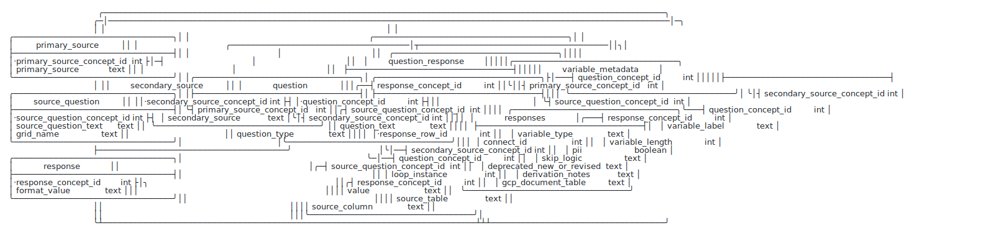
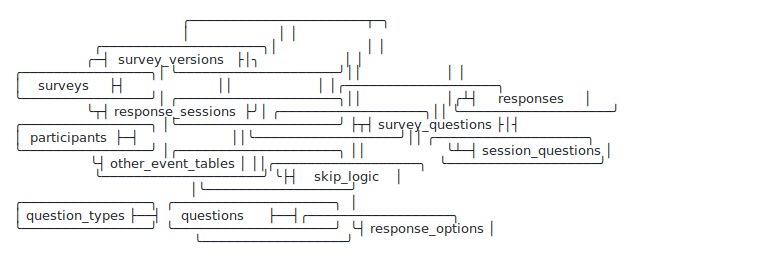
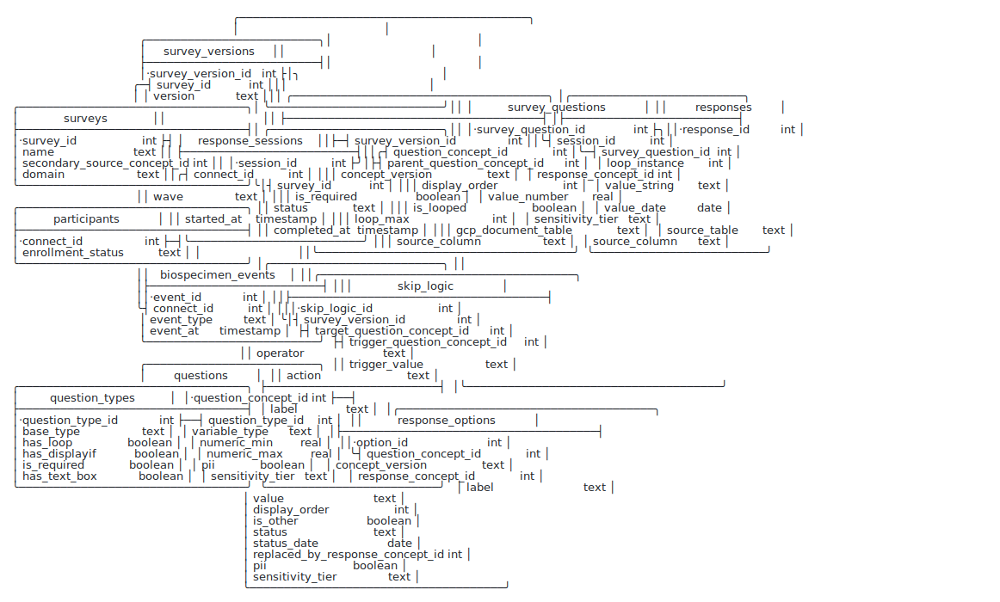

# Connect Data Model — Internal Pitch

**The ask:** build a relational layer over CleanConnect that stores survey answers in one long `responses`
table joined to the dictionary — in two phases. **Phase 1** is a small, fast win we can ship now; **Phase 2**
is the researcher-grade, governed warehouse PR2 needs.

---

## Why a data model at all?

Before any schema details: why model at all, instead of just querying the wide tables we already have?

What gives a data model its power isn't the table layout — it's that **the relationships between concepts, and
the domains they belong to, are defined explicitly, as data.** That is the real lesson of the **OMOP Common
Data Model** the team already endorses. OMOP's value isn't that everyone uses the same column names; it's that
statements like "this source code *maps to* that standard concept," "this condition *is a* kind of diabetes,"
"this concept *belongs to* the Condition domain" are all **modeled as queryable relationships**. Because those
relationships exist, an analysis can be written *once — against the relationships* (e.g. "everything that rolls
up to diabetes") — and reused unchanged across every team, study, and site. **Defined relationships between
concepts and domains are what make analytics standardized and reusable across research teams.**

That power doesn't require many data sources — it shows up the moment more than one *team* or *analysis* touches
the same data. Connect already has the raw material of those relationships — concepts, the question→response
links, the survey/domain groupings, versions, the equivalences between reused concepts — but they live
implicitly in column-name conventions and in analysts' heads, not as anything queryable. So every team
re-derives them by hand (below). The proposed model makes the same relationships OMOP defines first-class:

| What OMOP defines as a relationship | The same relationship in this model |
|---|---|
| `concept_relationship` "Maps to" — variant/source concept → one standard | `concept_relationship` / `question_equivalence` *(planned)* — reused & variant concepts harmonized to one |
| `concept_ancestor` — roll a concept up to a class/domain | dictionary hierarchy (domain → survey → source-question → question) + `parent_question_concept_id` |
| concept → domain membership | question/response → survey/domain, *modeled* — not encoded in `d_` column names |
| standardized relationships → ATLAS/HADES analytics reused across 200 sites | stable relationships → a shareable view/tool library reused across our teams + PR2 researchers |

**Honest scope:** Connect is *one* source, so we don't get OMOP's across-site network effect — but the
reusability comes from the *defined relationships*, not the number of sources, so we still get the within-source
version of it across our teams and external researchers. And OMOP itself becomes a clean downstream **export**
(the model already carries `omop_*` export in its backlog).

---

## Why — the problems we all live with

Our analysis-ready data is wide tables of opaque concept-ID columns. Concretely:

- **Dancing schema** — every new answer, option, or loop instance adds columns; downstream queries, views, and pipelines break as the upstream app evolves.
- **Not generically queryable** — every analysis hardcodes column names; nothing reuses across questions or surveys.
- **Version drift** — a revised question leaves parallel `v1`/`v2` columns analysts reconcile by hand.
- **Ambiguous missingness** — a blank cell could mean *not selected*, *not shown* (skip logic), or *survey not taken*.
- **No built-in governance** — sensitivity (PHI/PII) isn't in the schema; access is a manual, unenforced column allow-list.

### This isn't hypothetical — it's our own Module 1 report

Our flagship **"Merged Module 1 Summary Statistics"** (a scheduled Cloud Run pipeline, 6,234 lines) spends its
**first ~650 lines rebuilding the model by hand in R** before computing a single statistic:

- **A ~80-line hand-rolled v1/v2 merge** (pull `module1_v1` + `module1_v2`, intersect column names, coerce
  mismatched classes, `bind_rows`, `setdiff` the V1-/V2-only columns, dedupe anyone who did both). This
  brittle, column-name-dependent reconciliation **re-runs on every scheduled refresh** — exactly the
  dancing-schema + version-drift cost. The model does it once with `GROUP BY question_concept_id`.
- **A 150-entry label dictionary, typed by hand — with live bugs.** Concept `522680498` is mapped to *two*
  different labels (last one silently wins); `746038746` appears as both "Prefer Not to Answer" and "Prefer
  not to Answer"; typos ("Unble to Work") ship to output. Generated labels can't drift or collide.
- **Skip logic and loops reimplemented as bespoke functions** (`one_logic_funct`, `sib_logic_funct`,
  `child_logic_funct`), and the skip *trigger* is typed inconsistently across calls — sometimes `1`,
  sometimes `353358909`, sometimes `"353358909"`. In the model these are `skip_logic` + `loop_instance` data.
- **Missingness is mislabeled** — every per-question summary ends with
  `replace_na(list(answer = "Skipped this Question"))`, lumping *not-shown*, *not-answered*, and
  *survey-not-taken* into one "skipped" bucket. The reported "skipped" counts are inflated; Phase 2's
  sessions + skip-logic make that number *correct*.

<details><summary>Before / after — one of their own helpers (<code>one_logic_funct</code>)</summary>

```r
# TODAY — one helper per skip pattern; labels from the hand-typed `dict`; all NA -> "Skipped";
# and this only runs after the ~80-line v1/v2 merge above.
one_logic_funct <- function(CID, CID_prev, Prev_Answer, Title){
  CID_SYM <- rlang::ensym(CID); CID_SYM_P <- rlang::ensym(CID_prev)
  data_tib_m1 %>%
    filter(!!CID_SYM_P == Prev_Answer) %>%                  # skip logic, hardcoded per call
    group_by(!!CID_SYM) %>% summarize(n = n(), percentage = 100*n/nrow(.)) %>%
    mutate(answer = dplyr::recode(!!CID_SYM, !!!dict)) %>%  # labels from the 150-line hand dict (has collisions)
    replace_na(list(answer = "Skipped this Question"))      # not-shown / not-answered / not-taken all merged
}
one_logic_funct(D_338924834, D_323512813, "353358909", "PAIN2: Rank of Pain")
```

```sql
-- PHASE 1 — labels come from the dictionary (no hand-typed map, no collisions); the v1/v2 merge is gone
-- (both versions already pool under the concept); the skip condition is data, not a per-call argument.
SELECT resp.current_format_value AS answer, COUNT(*) AS n
FROM responses r
JOIN response resp USING (response_concept_id)
WHERE r.question_concept_id = 338924834
  AND EXISTS (SELECT 1 FROM responses p
              WHERE p.connect_id = r.connect_id
                AND p.question_concept_id = 323512813 AND p.response_concept_id = 353358909)
GROUP BY answer;
```

In Phase 2, the four hand-written `*_funct` helpers collapse into **one** shared, tested question-type view,
and `replace_na(... "Skipped")` is replaced by a real status (`not_shown` / `not_answered` / `not_taken`)
from sessions + skip-logic — so "skipped" finally means skipped.

</details>

### And our QA/QC engine compensates for the same missing structure

Connect's QA/QC system (`Analyticsphere/qaqc_testing`) is a **1,271-line rules engine** (46 QC-type branches,
29 handlers) driven by **14 hand-authored per-module Excel rule workbooks — 7,025 rules in total**. Bucketing
every rule by what it checks: **~85% re-state structure the dictionary already defines** (only ~15% are
genuinely bespoke), and **95% are gated on a cross-variable condition — i.e. skip logic**:

| The rule checks… | Rules (all 14 workbooks) | Already in the model as |
|---|---|---|
| Cross-variable condition (the skip gate on ~95% of rules) | 3,454 (49%) | `skip_logic` |
| Is numeric / date / time | 883 (13%) | `variable_metadata.variable_type` |
| String length | 792 (11%) | `variable_metadata.variable_length` |
| Answer ∈ valid option set | 773 (11%) | `response_options` |
| Populated / required | 65 (1%) | `skip_logic` / `is_required` |
| Genuinely custom | **1,058 (15%)** | — needs authoring |

So **~5,967 of 7,025 rules (85%)** are either dictionary metadata re-typed by hand (valid values, types,
lengths ≈ 35%) or skip-logic-shaped conditions the model encodes structurally (≈ 50%). Module 1 (884 rules,
95% generatable) and Module 2 (723, 95%) are the cleanest; Module 4 is the honest counter-case at ~50% custom
(more genuine clinical logic). Put the structure in the model and the bulk becomes *generated, not authored*.

Three tells it's missing structure, not necessary work: nearly every rule is prefixed `NA or` (unstructured
skip logic forces permissive checks, so a truly-missing required answer passes "NA or valid"); rule-type
strings have drifted (`isNumeric`/`IsNumeric`); and the workbook's last column is literally *"Nested rules
from markup (IMS)"* — they're hand-pulling rules from Quest, which is exactly the model's `skip_logic` source.
This repo also re-implements the v1/v2 merge a **third** time.

> **Honest scope (skip logic isn't trivial).** The ~85% figure is **contingent on the richer skip-logic
> representation** (the full QuickQ `skip_rule`: condition groups + an unanswered-trigger default + a
> raw-expression fallback). Connect's branching gets genuinely complex — measured on Quest module1, ~92% of
> `displayif` predicates are structurally representable and **~8% (nested boolean, computed cross-variable
> checks like `percentDiff`) are authored once as a preserved expression, not auto-generated.** Module 4 is the
> counter-case (~50% custom). So the win is **"authored once as shared, concept-linked data"** — not "free."

> **One line for the meeting:** *Across 14 QC workbooks we maintain 7,025 hand-written rules plus a 1,271-line
> engine to run them; ~85% just re-state valid values, types, lengths, and skip logic the dictionary already
> defines. We maintain a whole engine plus 14 workbooks to compensate for structure the model would give us for free.*

<sub>**How the QC figures were derived (reproducible):** parsed sheet 1 of each `qc_rules_*.xlsx` in
`Analyticsphere/qaqc_testing`, counting rows that carry a `ConceptID` or `Qctype`. Each rule was bucketed by
its `Qctype` keyword (`numeric` / `char` / `date`·`time` / `populated` / `match` / `crossvalid` / `valid` /
`custom`) and mapped to the model element that would generate it; "generatable" = every non-`Custom` bucket.
The ~35% pure value-set/type/length share is the conservative claim; the path to ~85% counts skip-logic-shaped
cross-variable rules, some of which are genuine constraints that would still be authored — but as one
structured `skip_logic` row, not a 20-column spreadsheet entry. The skip-logic supportability behind that
(~92% structured / ~8% raw-expression fallback) is measured separately on 276 Quest `module1` `displayif`
expressions (single + flat condition-group vs. nested-boolean + computed functions); module1 is the
stress-test module and QC-workbook conditions may differ, so treat it as indicative. Re-run both parses to
verify.</sub>

### And geocoding rebuilds the same harmonization three times

The same real-world field — *the street name of a residence* — is **~27 unrelated concept IDs** in the data
(11 home + 10 seasonal + work + previous-work + school + childhood + user-profile address slots), each
component its own 9-digit ID with **nothing linking them**. So three separate codebases each rebuild the
crosswalk from scratch:

- **`Geocoding.R`** collapses "year started at address" across ~33 columns with a **26-branch `case_when`** —
  and the "still living here" flag alone is **three different concept IDs** by address type.
- **`preprocess_geocoding_data`** reconstructs the address→component map by **string-matching the question
  label** (`"Street number"`, `"Full Street name"`) — using labels as join keys — plus a hand-maintained
  `manual_mappings.xlsx` (≈96 concept IDs mapped by hand) feeding a 25 KB `UNION ALL` query.
- **`geocoding-pipeline`** maintains a 26 KB view that "combines up to 27 different address types."

Because no `address` or `street_name` concept generalizes, nothing is reusable and the harmonization gets
re-derived (and can drift) per analysis — even leaning on label text, which we've shown drifts and carries
typos. The fix is the model's **concept-equivalence plane** (`concept_relationship` / `question_equivalence`):
it records "these are the same field" **once, as data**, and `loop_instance` turns the 21 home/seasonal slots
into rows — so the address schema is defined once, not rebuilt in three repos. This equivalence layer sits in
the model's backlog *beyond* Phase 2's first cut; **geocoding is the strongest argument to pull it forward.**
(Home vs. seasonal vs. work genuinely differ, so some harmonization is real work — the model just makes it
reusable, not re-coded.)

> **One line for the meeting:** *Three codebases geocode our addresses, and all three spend their effort
> rebuilding the same crosswalk — even string-matching question labels — because "street name of a residence"
> is 27 unrelated concept IDs with nothing tying them together. One equivalence table authors that link once.*

Step back and it's one diagnosis: **all of the above is us analyzing *source data* directly — raw concepts with
their relationships left undefined — which is exactly what a Common Data Model exists to stop.** Define the
relationships once (the way we already trust OMOP to), and the rebuilding stops. That is the model.

## The idea

Stop encoding answers as columns; store them as **rows** in a long `responses` table, and let the
**dictionary we already maintain** (`primary_source`, `secondary_source`, `question`, `response`,
`variable_metadata`) be the joinable metadata. Same thesis both phases — Phase 1 proves it cheaply,
Phase 2 builds it out.

---

## Phase 1 — Dictionary-Direct (start here)

<picture><source media="(prefers-color-scheme: dark)" srcset="connect_model_a_overview_dark.svg"></picture>

<details><summary>Full Phase 1 model (all columns) — the dictionary as-is, arranged like the CIDTool ERD, plus <code>responses</code></summary>

<picture><source media="(prefers-color-scheme: dark)" srcset="connect_model_a_dark.svg"></picture>

</details>

- **What it is:** the CIDTool dictionary tables loaded **as-is**, plus **one** new table — `responses`
  (grain `connect_id × current_source_question_concept_id × question_concept_id × loop_instance → response_concept_id / value`), which also carries `secondary_source_concept_id` — the survey, stamped at unpivot so answers to a reused concept resolve to the right survey — plus `source_table`/`source_column` provenance. Optional thin `question_type_norm` view for clean per-type SQL.
- **The lift — small:**
  1. Load CIDTool output into BigQuery (we already produce it).
  2. One **metadata-driven UNPIVOT** from CleanConnect → `responses`, generated per survey from the dictionary's column→concept map.
  3. *(optional)* `question_type_norm` view: messy `question_type` → clean `base_type` + flags.
  4. *(optional)* `v_responses_enriched` view: pre-joins the dictionary onto `responses` so every answer row is self-describing — **zero joins** for analysts (see [example_queries.md](docs/example_queries.md)). The friendly day-one surface and the seed of Phase 2's `fact_response`.
  - No new modeling, reuses CleanConnect + the dictionary verbatim, low risk.
- **What it buys:** stable schema (dancing stops), **generic SQL by `concept_id`/type**, labels **zero joins away** via the convenience view, **v1/v2 pool automatically** (both unpivot to the same concept), one answers table across all surveys.
- **What it does *not* buy (→ Phase 2):** governance, sessions/missingness, a placement bridge for grid/parent-path integrity, version/option-set unification, curated marts + lineage, researcher-facing naming. Multi-select/grids stay as the dictionary's binary 0/1 sub-question rows.
- **Important:** with no access control, Phase 1 is **not externally release-ready** — it's an internal/analyst layer (or coarse dataset-level IAM) until Phase 2.

## Phase 2 — Functional model (the PR2 warehouse)

<picture><source media="(prefers-color-scheme: dark)" srcset="connect_data_model_overview_dark.svg"></picture>

<details><summary>Full Phase 2 model (all columns)</summary>

<picture><source media="(prefers-color-scheme: dark)" srcset="connect_data_model_dark.svg"></picture>

</details>

- **What it adds:** cleaned researcher-facing dimensions; a **placement bridge** (`survey_questions`) so reused concepts and grids/select-all resolve cleanly; **sessions** (`response_sessions`, derived from participant status/timing) for completion + missingness; **version-scoped `response_options`**; layered **Core → Analytic → Marts**; governance built in.
- **The lift — larger, but incremental on Phase 1's `responses` fact, and phaseable:**
  - dimension cleanup + type normalization + placement/session derivation;
  - **governance**: `sensitivity_tier` classification → BigQuery **row-access policies** → three **release tiers** (Sensitive / Core / Public) with date-shift, masking, and cell-size suppression;
  - **analytic layer**: `fact_response`, dimensions, aggregates, a question-type **view library**;
  - **curated marts** with full lineage (dbt proposed).
- **What it buys:** tidy multi-select, version/option validity, **true missingness**, **governed per-sensitivity access**, reproducible derived variables with lineage, and a shareable query/view library — the trustworthy contract PR2 needs to share with the research community.

## Curated derived variables — governable dbt marts

The highest-value case of "write analytics once": define each research variable **once, canonically, with lineage to source** — a single `pack-years`, `BMI`, or polygenic risk score every researcher reuses, instead of re-deriving it per study (the divergence the three pain repos show). These are **marts**, built downstream of Core with **dbt**.

**Why dbt** — each capability maps to a guarantee researchers need to trust a derived variable:

| Requirement | dbt delivers |
|---|---|
| Lineage intact to source | `dbt docs` column-/model-level DAG: each variable → Core → `responses` → concept IDs |
| Not a black box | the model **SQL is the definition** — readable, versioned, critiqueable |
| Layer boundary holds | `source()`/`ref()` + model `access` keep Core private, marts the public surface |
| QC as contracts | dbt **tests** in CI (`accepted_values`, `pack_years >= 0`, BMI range) — much of the 7,025-rule engine becomes tests |
| Governance designed in | `sensitivity_tier` flows via model metadata to marts; enforcement stays in **IAM** |

**Mart catalog** (one mart per construct, grouped — mapped to established cancer-prevention exposure domains):

| Group | Example marts | Canonical derived variable |
|---|---|---|
| Behavioral | smoking · alcohol · physical_activity · diet | **pack-years** · MET-hours/week |
| Anthropometric | anthropometry | **BMI** (height + weight) |
| Host | reproductive_history · family_history · genetic_risk | parity · hereditary-risk flag · **polygenic risk score** |
| Clinical | medical_history · medications · screening_history | comorbidity index · regular aspirin use · up-to-date-with-screening |
| Environmental | environmental_exposures | **Area Deprivation Index** (from the geocoded address) |
| Foundational | demographics | age · sex · race/ethnicity · education · income |

**Honest scope:** dbt is a real skill/CI/ownership dependency; Core stays *out* of dbt (it's a `source`); governance stays in **IAM** (dbt builds the tier-specific marts, it doesn't gate access); marts are curated — **not** the only access (raw `responses` stays reachable); and derivation is genuine epidemiological work — dbt makes each variable reproducible and reusable, **not automatic** (every mart needs an owner, tests, and epi sign-off).

---

## Value proposition — the same queries, three ways

| Standard query | Wide (today) | Phase 1 | Phase 2 |
|---|---|---|---|
| Multi-select distribution | unpivot + v1/v2 COALESCE + known columns | filtered group-by; versions pool | plain group-by / view |
| Labeled distribution, *any* question | bespoke `CASE`, no reuse | parameterized by `concept_id` (+ type view) | precomputed aggregate |
| Completion & **true** missingness | cross-table, ambiguous | still ambiguous (no sessions) | sessions + skip logic |
| Non-PHI extract (**governance**) | manual allow-list | manual allow-list | sensitivity tier + IAM |
| Harmonized field across surveys/variants | rebuild the crosswalk by hand (3 repos) | reused concept pools by `concept_id` (survey via stamped coord) | full variant-equivalence via `question_equivalence` *(planned)* |

Phase 1 flips schema-stability and generic querying from *painful/impossible* to *routine* and lets a reused
concept pool across surveys; Phase 2 makes true missingness and governance possible at all, and the
field-harmonization row is fully realized once the equivalence plane lands. Worked SQL below (example concept
IDs: the tooth-loss select-all `899251483` / follow-up `724589244`, and the reused "Survey Language" concept
`784119588`).

### Q1 — distribution of a multi-select ("reasons for tooth loss")
```sql
-- WIDE: unpivot one indicator column per option, doubled across v1/v2, COALESCE'd by hand
SELECT 'accident' AS reason, COUNTIF(COALESCE(d_899251483_d_812107266_v2, d_899251483_d_812107266)='353358909') n
FROM `CleanConnect.mouthwash`
UNION ALL SELECT 'tooth decay', COUNTIF(COALESCE(d_899251483_d_452438775_v2, d_899251483_d_452438775)='353358909')
FROM `CleanConnect.mouthwash`;   -- …and you must know every option column + the v2-only ones

-- PHASE 1: one table, labels via join, v1/v2 pool automatically
SELECT q.current_question_text AS reason, COUNT(*) n
FROM responses r JOIN question q USING (question_concept_id)
WHERE r.current_source_question_concept_id = 899251483 AND r.response_concept_id = 353358909
GROUP BY reason;

-- PHASE 2: one row per selected option — a plain group-by
SELECT o.label AS reason, COUNT(*) n
FROM responses r
JOIN survey_questions sq ON sq.survey_question_id = r.survey_question_id
JOIN response_options o ON o.question_concept_id = sq.question_concept_id AND o.response_concept_id = r.response_concept_id
WHERE sq.question_concept_id = 899251483 GROUP BY reason;
```

### Q2 — labeled distribution for *any* question
```sql
-- WIDE: bespoke CASE per question; nothing generalizes
SELECT CASE d_724589244 WHEN '349122068' THEN '1' WHEN '194129782' THEN '2 to 4' /* … */ END AS answer, COUNT(*) n
FROM `CleanConnect.mouthwash` GROUP BY answer;

-- PHASE 1: labels via join; swap the concept_id to run it for ANY question
SELECT resp.current_format_value AS answer, COUNT(*) n
FROM responses r JOIN response resp USING (response_concept_id)
WHERE r.question_concept_id = 724589244 GROUP BY answer;

-- PHASE 2: read a precomputed aggregate
SELECT answer_label AS answer, n FROM agg_question_distribution WHERE question_concept_id = 724589244;
```

### Q3 — completion & **true** missingness (Phase 2 only)
```sql
-- WIDE & PHASE 1: a blank/absent answer can't distinguish not-shown vs not-answered vs survey-not-taken.

-- PHASE 2: sessions give status; skip_logic gives reachability
SELECT s.status, COUNT(DISTINCT s.connect_id) participants,
       COUNT(DISTINCT IF(r.response_id IS NOT NULL, s.connect_id, NULL)) answered_x
FROM response_sessions s
JOIN survey_questions sq ON sq.question_concept_id = /* X */ 0
LEFT JOIN responses r ON r.session_id = s.session_id AND r.survey_question_id = sq.survey_question_id
WHERE s.survey_id = /* Module 1 */ 0 AND s.wave = 'baseline'
GROUP BY s.status;
```

### Q4 — non-PHI extract / **governance** (Phase 2 only)
```sql
-- WIDE & PHASE 1: no sensitivity in the schema — a manual, unenforced allow-list of "safe" fields.

-- PHASE 2: sensitivity is data + enforced by a BigQuery row-access policy; the researcher's query is unchanged
SELECT * FROM responses WHERE sensitivity_tier = 'non_sensitive';
```

### Q5 — a field that recurs across surveys / variants (harmonization)
```sql
-- WIDE: the same concept is a separate column in each survey table — UNION them by hand, per table
SELECT 'module1' AS survey, d_784119588 AS lang FROM `CleanConnect.module1`
UNION ALL SELECT 'covid_19', d_784119588 FROM `CleanConnect.covid_19`;   -- …repeat for all 15 surveys

-- PHASE 1: one reused concept, one query across every survey it appears in (survey via the stamped coordinate)
SELECT secondary_source_concept_id AS survey, response_concept_id, COUNT(*) n
FROM responses WHERE question_concept_id = 784119588          -- "Survey Language", appears in 15 surveys
GROUP BY survey, response_concept_id;

-- PHASE 2 (+ equivalence plane): unify DIFFERENT concepts that mean the same field (e.g. 27 address fields)
SELECT q.label, COUNT(*) n
FROM responses r JOIN dim_question q USING (question_concept_id)
WHERE q.equivalence_group_id = /* residence_street_name */ 0  -- one group, authored once
GROUP BY q.label;
```
**Takeaway:** wide rebuilds the crosswalk by hand in every repo; Phase 1 already pools a *reused* concept across surveys with one query; Phase 2's equivalence plane extends that to *different* concepts that mean the same thing (the geocoding case).

## Transformation lift at a glance

| | **Phase 1** | **Phase 2** |
|---|---|---|
| New objects we build | 1 table (`responses`) [+ 1 view] | ~10 dims/facts + analytic + marts |
| Reuses | CleanConnect + CIDTool verbatim | Phase 1's `responses` fact |
| New modeling | none | dimensions, sessions, governance, marts |
| Risk | low | moderate, phased |
| Governance | none (bolt-on later) | built in (row-access + release tiers) |
| Externally release-ready | no | yes |

---

## Recommendation

1. **Approve Phase 1 now.** Low cost, low risk, immediately useful, and a genuine down payment — its
   `responses` fact carries into Phase 2 unchanged.
2. **Commit to Phase 2** as the funded path to the PR2 research warehouse — especially **governance** and
   **lineage**, which Phase 1 deliberately defers and which are non-negotiable for sharing data externally.

Net: Phase 1 = an internal quick win that proves the model; Phase 2 = the governed, shareable product.
